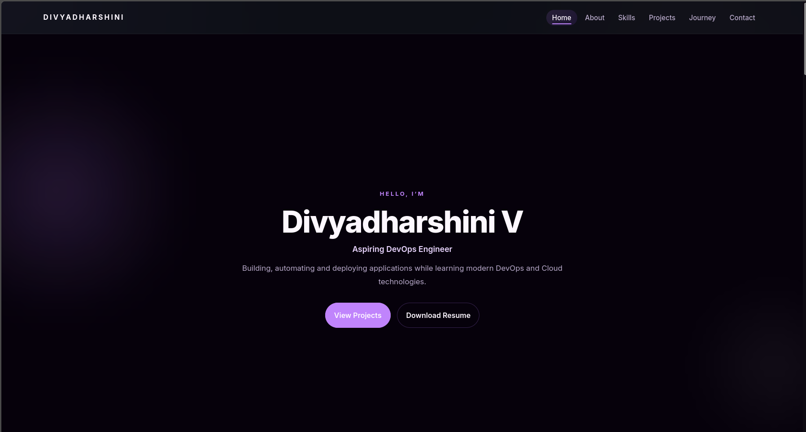

# End-to-End DevOps Portfolio



A personal portfolio website showcasing my DevOps learning journey, projects, and technical skills. This project is built as part of my hands-on DevOps learning and will continue to evolve as I learn new technologies.

## Features

- Responsive single-page portfolio
- Modern UI built with HTML, CSS, and JavaScript
- Project showcase
- DevOps learning timeline
- Contact section
- Downloadable resume
- Automated deployment using GitHub Actions
- Hosted using GitHub Pages

## Technologies Used

- HTML5
- CSS3
- JavaScript
- Git
- GitHub
- GitHub Actions
- GitHub Pages

## Project Structure

```
end-to-end-devops-portfolio/
│
├── .github/
│   └── workflows/
│       └── deploy.yml
├── images/
├── resume/
├── index.html
├── style.css
├── script.js
└── README.md
```

## Live Demo
g
Portfolio Website:

https://divi-0625.github.io/End-to-End-DevOps-Portfolio/

## Future Enhancements

This project will be enhanced as I progress in my DevOps learning journey by adding:

- Docker containerization
- Nginx web server configuration
- AWS EC2 deployment
- Functional contact form
- CI/CD enhancements
- Custom domain

